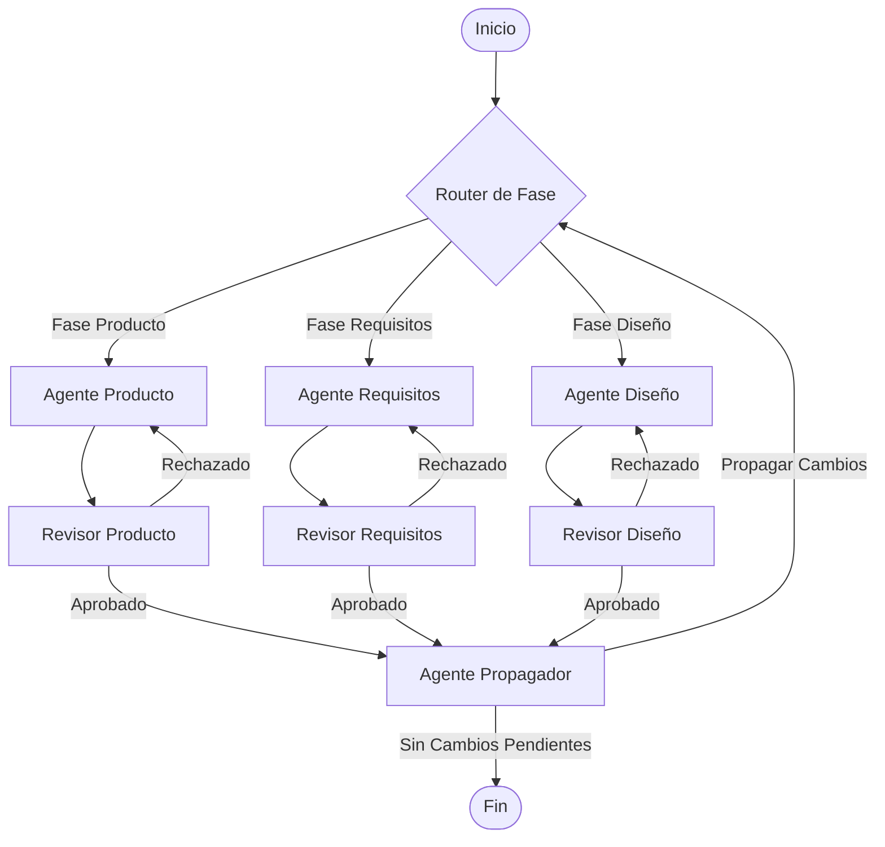

# KOSMO — Plataforma de Desarrollo Guiado por Especificaciones (Spec-Driven Development - SDD)

**KOSMO** es una plataforma y prototipo de investigación para el **Desarrollo Guiado por Especificaciones (SDD)**. Su objetivo es automatizar y asistir el ciclo de vida del desarrollo de software mediante un sistema multi-agente colaborativo que genera, valida y mantiene alineadas las especificaciones de negocio, los requisitos y el diseño técnico del sistema.

El repositorio se divide en dos componentes principales:
1. **`backend`**: El motor lógico del flujo de agentes, desarrollado con **Python**, **LangGraph** y **LangChain**.
2. **`frontend`**: La interfaz de usuario interactiva para el espacio de trabajo del desarrollador, desarrollada con **React 19**, **TypeScript** y **TanStack Start**.

---

## 🛠️ Arquitectura y Funcionamiento (Backend)

El backend implementa un grafo de agentes utilizando **LangGraph** (`flujo.py`) que gestiona el estado transicional de las especificaciones de software a través de tres fases y sus respectivos bucles de validación y propagación:



### 1. Fases del Flujo de Desarrollo

*   **Fase de Producto (Product Spec):**
    *   **Agente:** Genera un documento estructurado de definición del producto (`producto.md`) a partir de la idea del usuario.
    *   **Plantilla:** Sigue un formato con Resumen Ejecutivo, Problema, Público Objetivo, Propuesta de Valor, Capacidades Clave, Casos de Uso, Alcance (Dentro/Fuera), Métricas de Éxito y Restricciones.
*   **Fase de Requisitos (Requirements Spec):**
    *   **Agente:** Traduce el documento de producto a especificaciones de requisitos funcionales detalladas.
    *   **Sintaxis EARS:** Estructura los criterios de aceptación usando la sintaxis **EARS** (*Easy Approach to Requirements Syntax*) con palabras clave como `When`, `If`, `While`, `Where`, y `The system shall`. Se enfoca puramente en lógica de negocio (sin detalles de interfaz gráfica).
*   **Fase de Diseño Técnico (Design Spec):**
    *   **Agente:** Traduce los requisitos en un modelo de dominio formal representado mediante un script de **BUML** (*Besser UML*), una herramienta de modelado basada en Python.
    *   **Resultado:** Genera un archivo `diseno.py` con clases, atributos, métodos, enumeraciones, herencia (generalizaciones) y asociaciones (composición y agregación) estructuradas en el DSL de BUML.

### 2. Agentes Revisores (Quality Assurance)
Cada fase cuenta con un agente revisor (`product_reviewer`, `requirement_reviewer`, `design_reviewer`) que valida criterios sintácticos y de calidad específicos. 
*   Si el revisor encuentra fallos, devuelve un feedback estructurado al agente creador correspondiente para que corrija el documento de manera automática.
*   Existe un límite de seguridad de hasta 3 iteraciones de corrección; si no se logra la aprobación al tercer intento, el sistema aprueba por defecto para evitar bucles infinitos.

### 3. Mecanismo de Propagación de Cambios (Propagador)
Una de las innovaciones clave es el **nodo propagador**. Si se modifica una especificación intermedia, el sistema propaga los cambios para asegurar la consistencia del árbol documental:
*   Si el **Producto** cambia $\rightarrow$ Se propaga el cambio a **Requisitos**.
*   Si los **Requisitos** cambian $\rightarrow$ Se propagan los cambios a **Producto** y a **Diseño**.
*   Si el **Diseño** cambia $\rightarrow$ Se propaga el cambio a **Requisitos**.

---

## 💻 Interfaz de Usuario (Frontend)

El frontend representa el espacio de trabajo visual de la plataforma **KOSMO**:

*   **Pila Tecnológica:** React 19, TypeScript, **Vite**, **TanStack Start** (enrutamiento basado en archivos y servidor Nitro integrado) y **Tailwind CSS**.
*   **Editor de Fases Interactivo:** Permite navegar por las fases de Descubrimiento (Brief), Requisitos, Diseño y Planificación de Tareas.
*   **Modelador UML Integrado:** Incorpora el editor UML **Apollon** (`@tumaet/apollon`) para visualizar y estructurar diagramas de clases UML de forma interactiva en la fase de Diseño.
*   **Simulación de Agentes:** Muestra animaciones y estados de trabajo de los agentes de IA en tiempo real (modo demo/mock-up de alta fidelidad).

---

## 📂 Estructura del Repositorio

```text
SDD-PIIF-24-01/
├── backend/                  # Orquestador del flujo multi-agente
│   ├── flujo.py              # Definición del grafo LangGraph y CLI interactivo
│   ├── prompts.py            # Prompts de creación, edición y revisión de agentes
│   ├── templates.py          # Plantillas de Producto, Requisitos y BUML
│   ├── tools.py              # Herramientas de agentes (guardado de especificaciones)
│   └── requirements.txt      # Dependencias del backend
│
├── frontend/                 # Interfaz web de KOSMO
│   ├── src/
│   │   ├── components/       # Componentes de UI (VibeChat, Apollon, editores de fase)
│   │   ├── hooks/            # Hooks de estado local y configuración de agentes
│   │   ├── routes/           # Rutas y páginas de TanStack Start (index.tsx, auth.tsx)
│   │   ├── server.ts         # Entrada del servidor Nitro
│   │   └── styles.css        # Estilos globales y Tailwind CSS
│   ├── package.json          # Dependencias y scripts de Vite/Nitro
│   └── tsconfig.json         # Configuración de TypeScript
│
└── README.md                 # Documentación general del proyecto (este archivo)
```

---

## 🚀 Instrucciones de Instalación y Uso

### Backend

El backend requiere **Python 3.10+**.

1. Navega al directorio del backend:
   ```bash
   cd backend
   ```
2. Instala las dependencias necesarias:
   ```bash
   pip install -r requirements.txt
   ```
   *(Opcional: Si vas a ejecutar el script de diseño generado en `specs/diseno.py`, requerirás la librería `besser-BUML`)*:
   ```bash
   pip install besser-BUML
   ```
3. Configura tu API Key de OpenAI en `flujo.py` (línea 55) o define la variable de entorno:
   ```python
   OPENAI_API_KEY = "tu-api-key-aqui"
   ```
4. Ejecuta el CLI del flujo interactivo:
   ```bash
   python flujo.py
   ```

### Frontend

El frontend requiere **Node.js** (o **Bun** para una ejecución más veloz).

1. Navega al directorio del frontend:
   ```bash
   cd frontend
   ```
2. Instala las dependencias:
   * Con **Bun**:
     ```bash
     bun install
     ```
   * Con **NPM**:
     ```bash
     npm install
     ```
3. Ejecuta el servidor de desarrollo local:
   * Con **Bun**:
     ```bash
     bun dev
     ```
   * Con **NPM**:
     ```bash
     npm run dev
     ```
4. Abre [http://localhost:3000](http://localhost:3000) (o el puerto indicado en la consola) en tu navegador para ver la interfaz interactiva.

---

## 🎓 Contexto de Investigación

Este proyecto se desarrolla en el marco de una investigación académica en la **Escuela Politécnica Nacional (EPN)** para el proyecto **PIIF** (Proyecto de Investigación / Innovación Tecnológica). Busca evaluar la efectividad de los flujos de trabajo basados en grafos de estado de agentes (como LangGraph) para la consistencia documental bidireccional y la generación automática de código y modelos de dominio en el desarrollo de software.
